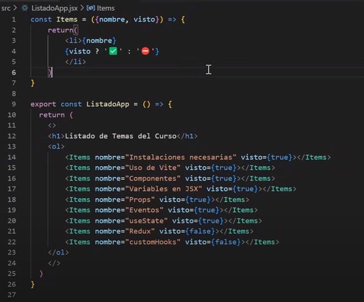

## React

- Los componentes pueden devolver un solo nodo raíz.
- Si necesitas devolver múltiples elementos sin envolverlos en un `div`, usa Fragmentos: `<>` y `</>`.

```jsx
export const PrimerComponente = () => {
    return(
    <>
    <h1>Hola mundo</h1>
    </>
    )
}
```

Hay un archivo llamado "main.jsx" este deberia de importarlo asi:

```jsx
import React from 'react'
import ReactDOM from 'react-dom/client'
import './index.css'
import { PrimerComponente } from './primerComponente.jsx'

ReactDOM.createRoot(document.getElementById('root')).render(
  <React.StrictMode>
    <PrimerComponente />
  </React.StrictMode>,
)
```

## Mandar datos de un componente a otro, ejemplo
```jsx
ReactDOM.createRoot(document.getElementById('root')).render(
  <React.StrictMode>
    <PrimerComponente titulo="Esta seccion es de props" subtitulo="Curso React"/>
  </React.StrictMode>,
)
```

# PROPS TYPE
Con esto se puede solicitar recibir un tipo dato en el componente

Abajo de todo poner:

```jsx
import PropTypes from 'prop-types';

PrimerComponente.propTypes = {
    titulo: PropTypes.string.isRequired,
    subtitulo: PropTypes.string.isRequired
  };
```

# PROPS DEFAULT
Con esto puedes definir valores predeterminados para las props.
```jsx
  PrimerComponente.defaultProps = {
    titulo: 'Curso de React',
    subtitulo: 'Sección de props'
  };
```


En caso de no mandar parametros tambien se puede usar
```jsx
export const PrimerComponente = ({titulo='hola', subtitulo='mundo'}) => {
    return(
    <>
    <h1>{titulo}</h1>
    <h1>{subtitulo}</h1>
    </>
    )
}
```

Asi como minimo tenemos ese valor asegurado ( si no mandamos nada nos queda el valor definido ahi)

### Introducciona HOOKS y eventos

```jsx
import './styles/componente.css';
import { useState } from 'react';

const Button = ({ onClick }) => {
  return (
    <button onClick={onClick}>
      Soy un botón
    </button>
  );
};

export const PrimerComponente = () => {
  const [contador, setContador] = useState(0);

  const handleClick = () => {
    setContador(contador + 1);
    console.log(contador + 1);
  };

  return (
    <>
      <h1>Contador:</h1>
      <h1>{contador}</h1>
      <Button onClick={handleClick} />
    </>
  );
};
```

Y en el Main asi:

```jsx
  <React.StrictMode>
    <PrimerComponente value ={500}/>
  </React.StrictMode>
```

### Condicionales y ternarios

Reescribir esto



